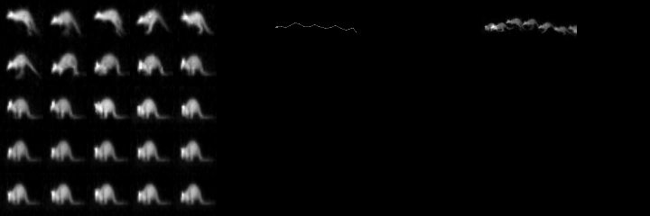

# Usage

## Downloading the Dataset

CPTV files can be downloaded using the [cptv-downloader](https://github.com/TheCacophonyProject/cptv-download) tool.

## Training the Model

First download the CPTV files by running

`python cptv-download.py --user x --password x`

Next load the track files.  This can take some time

`python load.py all -v -p`

Now we can build the data set

`python build.py`

And finally train the model

`python train.py <build name>`

## Database format

Load.py will create a hdf5 file (dataset.hdf5) The format of this is described here:
https://docs.google.com/document/d/1iPsp-LWRva8YTQHwXRq8R1vjJKT58wRNCn_8bi6BoW8/

## Classifying animals within a CPTV File

A pre-trained model can be used to classify objects within a CPTV video

`python classify.py [cptv filename]`

This will generate a text file listing the animals identified, and create an MPEG preview file.

## Classification and Training Images

Single frame models use 48 x 48 frames to classify/train

Multi frame models use:
 * 25 frames arranged in a square for the red channel
 * Dots describing the centre of all tracked regions and lines connecting the dots for the green channel
 * Track Filtered frames overlaid where they have moved enough from the previous overlaid frame for the blue channel

## Release and Update

1. Create a release on GitHub (https://github.com/TheCacophonyProject/Project-Overview/wiki/Releases)

2. SSH into server

3. wget latest installer from GitHub

	`wget https://github.com/TheCacophonyProject/classifier-pipeline/releases/download/vx.x.x/classifier-pipeline_x.x.x_amd64.deb`

4. Install downloaded deb

	`sudo apt install ./classifier-pipeline_x.x.x_amd64.deb`

5. Make changes to config file if needed

	`/etc/cacophony/classifier.yaml`

6. Restart service

	`systemctl restart cacophony-processing.thermal@xx.service`

7. View logs

	`journalctl -u cacophony-processing.thermal@xx.service -f`

# Testing Classification and Tracking

## Generating Tests

- Tests can be generated from existing videos files on browse. The tests will contain
the tracks and tagged results as shown in browse by default.
- Test metadata will be saved to a yml file(tracking-tests.yml by default). This
may require manual editing to setup the tests if the original browse video did not track / classify
well
- Test CPTV files will be saved under out_dir and labelled as recordingid.cptv

`python generatetests.py out_dir Username Password <list of recording ids separated by a space>`

e.g.

`python generatetests.py test_clips Derek password123 12554 122232`

## Running Tests

- Once tests have been generated you can test your current tracking and model against thermal
- This will print out the results and also save a file called tracking-results.txt
- A default set of tracking tests is located in 'tests/tracking-tests.yml'
in order to run the clips they will need to be downloaded this can be done automatically
by adding a valid cacophny api user and password to trackingtest.py
`python trackingtest.py -t tests/tracking-tests.yml --user <User> --password <password>`

## Tracking results

Results for tests/tracking-tests.yml on tracking algorithms are located here
https://drive.google.com/drive/u/1/folders/1uGU9FhKaypadUVcIvItBZuZebZa_Z7MG
