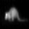
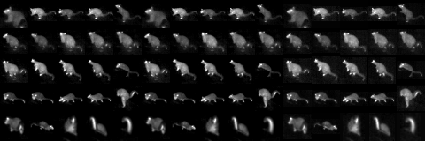
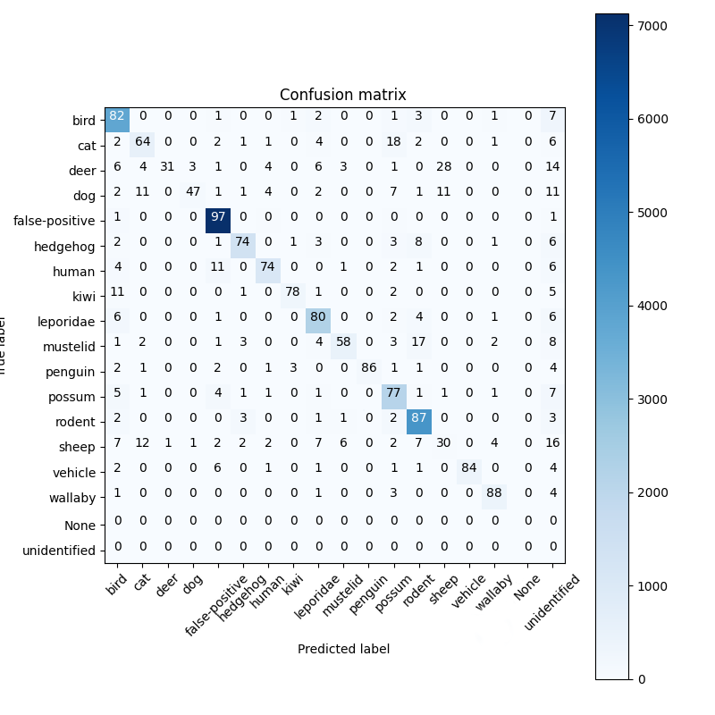

# Overview

These scripts handle the data pre-processing, training, and execution of a Convolutional Neural Network based classifier
for thermal vision.

The output is a TensorFlow model that can identify thermal video clips of animals

# Scripts

### build.py
Creates training, validation and testing datasets from database of clips & tracks.
Datasets contain frames or segments ( e.g. 45 frames).

Frames (important frames) are calculated by choosing frames with a mass ( the count of pixels that have been deemed an object by track extraction) between the lower and upper quartiles of a tracks mass distribution.

Segments are calculated  by choosing segment duration consecutive frames whose mass is above a certain amount        
- Number of Segments up to (# of frames - segment duration) // segment-frame-spacing

Datasets are split by camera and location ( to try and remove any bias that may occur from using a camera in multiple sets).

Some labels have low amounts of data so they are split by clip_id i.e. wallaby and penguin

### train.py
Trains a neural net using a provided test / train / validation dataset.

### extract.py
Extract tracking information for a specified CPTV file

### classify.py
Uses a pre-trained model to identifying and classifying any animals in supplied CPTV file, CPTV file must have associated metadata generated from extract.
Classifier will produce a JSON output either to terminal or txt file.

#### thumbnail algorithm
A single region to be used as the thumbnail will be chosen per recording and saved in the JSON output

If a recording has tracks
- An overriding tag based on the number of occurrences of an animal is chosen, with any
animal being favoured over false-positive
e.g. rat, possum, possum, false-positive, false-positive, false-positive.... Will be a possum tag

- All tracks will be scored on prediction confidence, standard deviation of mass and mass.
- Choose highest scoring track and take the region with the 75th percentile mass as the thumbnail region

If there are no tracks for a recording

Choose the region with greatest mass if any regions exist (these are points of interest that never eventuated into tracks)

Otherwise take the frame with the highest mean pixel value and find the highest mean pixel 64 x64 region

### modelevaluate.py
Evaluates the performance of a model

# Setup

Install the following prerequisites (tested with Ubuntu 18.0 and Python Python 3.6.9)
`apt-get install -y tzdata git python3 python3-dev python3-venv libcairo2-dev build-essential libgirepository1.0-dev libjpeg-dev python-cairo libhdf5-dev`
1. Create a virtual environment in python3 and install the necessary prerequisites  
`pip install -r requirements.txt`

2. Copy the classifier_Template.yaml to classifier.yaml and then edit this file with your own settings.   You will need to set up the paths for it work on your system. (Note: Currently these settings only apply to classify.py and extract.py)

3. Optionally install GPU support for tensorflow (note this requires additional [setup](
https://www.tensorflow.org/install/gpu)) 
`pip install tensorflow-gpu`

4. MPEG4 output requires FFMPEG to be installed which can be found [here](https://www.ffmpeg.org/) On linux `apt-get install ffmpeg`.  On windows the installation path will need to be added to the system path.

5. Create a classifier configuration

Copy `classifier_TEMPLATE.yaml` to `classifier.yaml`. Edit.

# Usage

## Downloading the Dataset

CPTV files can be downloaded using the [cptv-downloader](https://github.com/TheCacophonyProject/cptv-download) tool.

## Training a Model

First download the CPTV files by running

`python cptv-download.py <dir> <user> <password>`

Now we can build the data set. Move to the src directory.

`python build.py <dir> --ext ".cptv"`

And train the model

`python train.py <build name>`

This will build a model under the default parameters which reflect the production model

### Preparing model for use

Once you have trained a model use tfliteconverter script to export the model for inference.

`python3 tfliteconverter.py -f <path to store model> -e -m <model_path>` -w <model_weights>

This will export the model to the supplied path

Tar this folder 

`tar czf <datetime and model type>.tar -C <frozen model path> .`

Make a release https://github.com/TheCacophonyProject/AI-Model/releases
and attach the tar file as an asset.

If this is a server side prediction model use the prefix server-<VERSION> in your release name.
If this is a pi model use the prefix pi-<VERSION> in your release name

## Database format

Load.py will create a hdf5 file (dataset.hdf5) The format of this is described here:
https://docs.google.com/document/d/1iPsp-LWRva8YTQHwXRq8R1vjJKT58wRNCn_8bi6BoW8/

## Classifying animals within a CPTV File

A pre-trained model can be used to classify objects within a CPTV video
`python extract.py [cptv filename]`
`python classify.py [cptv filename]`

This will generate a text file listing the animals identified, and create an MPEG preview file.

## Classification and Training Images

Single frame models use 48 x 48 frames to classify/train

Multi frame models use:
 * 25 frames arranged in a square

## Release and Update

### Releasing prcoessing changes

1. Create a release on GitHub (https://github.com/TheCacophonyProject/classifier-pipeline)

2. SSH into processing server

3. By default processing will use the latest pipeline release. If you have changed these settings, make sure that in the  config file ( Default location is `/etc/cacophony/processing.yaml` ) the key `classify_image` references the release version you just made

### Release pi tracking code

1. In order to built a release for pi update the version in `pyproject.toml`

2. Then you need to merge the changes into the `pi-classifier` branch. This will automatically create a release here
https://pypi.org/project/classifier-pipeline/

3. This can then be installed on via pip

# Testing Classification and Tracking

## Generating Tests

- Tests can be generated from existing videos files on browse. The tests will contain
the tracks and tagged results as shown in browse by default.
- Test metadata will be saved to a yml file(tracking-tests.yml by default). This
may require manual editing to setup the tests if the original browse video did not track / classify
well
- Test CPTV files will be saved under out_dir and labelled as recordingid.cptv

`python generatetests.py out_dir Username Password <list of recording ids separated by a space>`

e.g.

`python generatetests.py test_clips Derek password123 12554 122232`

## Running Tests

- Once tests have been generated you can test your current tracking and model against thermal
- This will print out the results and also save a file called tracking-results.txt
- A default set of tracking tests is located in 'tests/tracking-tests.yml'
in order to run the clips they will need to be downloaded this can be done automatically
by adding a valid cacophny api user and password to trackingtest.py
`python trackingtest.py -t tests/tracking-tests.yml --user <User> --password <password>`

## Tracking results

Results for tests/tracking-tests.yml on tracking algorithms are located here
https://drive.google.com/drive/u/1/folders/1uGU9FhKaypadUVcIvItBZuZebZa_Z7MG

## IR Videos
- Ir videos are built with build.py and saved as tf records
- https://github.com/sulc/tfrecord-viewer is very useful for vieweing the images stored in these files
- `python3 tfviewer.py <config.base_data_folder>/<config.tracks_folder>/training-data/<set to see train/vaidation/train>/*.tfrecord --overlay classification --image-key image/thermalencoded`

## TF Lite Conversion
- Use tfliteconverter.py `python3 tfliteconvert.py -m <path to saved model> -w <weights to use> -c`
Will save to <path to saved model>/tflite/converted_model.tflite
- Can test running new model by using `python3 tfliteconvert.py -m <path to tf lite model>` -r`
- Can test save weights into model file new model by using  `python3 tfliteconvert.py -m <path to saved model> -w <weights to use> -f`

## Neural Compute Conversion
- Will need the intel tools from `https://www.intel.com/content/www/us/en/developer/articles/guide/get-started-with-neural-compute-stick.html`
- Tested on Inceptionv3 models `python3 ~/intel/openvino_<VERSION>/deployment_tools/model_optimizer/mo_tf.py --saved_model_dir <Path to dir with weights saved to saved_model.pb> --input_shape [1,<width>,<height>,3]`
- Make sure to also copy the metadata.txt to go with this converted file, this should be renamed to the same as te converted model .txt, by default it saves as saved_model.xml so metadata.txt should be copied to saved_model.txt

## PYPI
- To run the tracking and classification on a pi can use the pre build package by running `pip install classifier-pipeline`.
This will install the executable `pi_classify` which can be used to connect to leptond or an ir camera
- In order to build a new version the version number in pyproject.toml must be updated and the code pushed to the pi-classifier branch

## Lila Dataset
- A public dataset is available here [Lila Dataset](https://lila.science/datasets/new-zealand-wildlife-thermal-imaging/)
- This dataset can be trained on like so:

1. Download the data set [Lila Dataset Download](https://storage.googleapis.com/public-datasets-lila/nz-thermal/new-zealand-wildlife-thermal-imaging.zip)

2. Download the suggested split [Dataset split](https://storage.googleapis.com/public-datasets-lila/nz-thermal/new-zealand-wildlife-thermal-imaging-splits.zip)

3. Unzip the contents of both files

4. Clone this repository

5. Make a python3 virtual environment if youd like and tnstall requirements `pip install -r requirements.txt`

6. go into source dir `cd src`

7. Build the dataset into tf records
`python3 build.py --split-file <PATH TO DATASET SPLIT>` <PATH TO HDF5 FILES>`

8. Train the model
`python3 train.py <training name>`

- This will produce similar accuracies on the test dataset to this confusion matrix
- 
